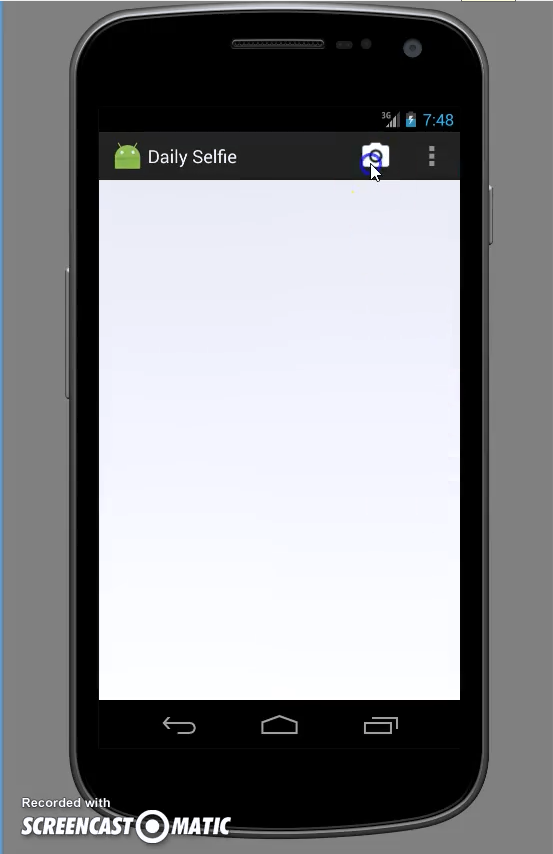
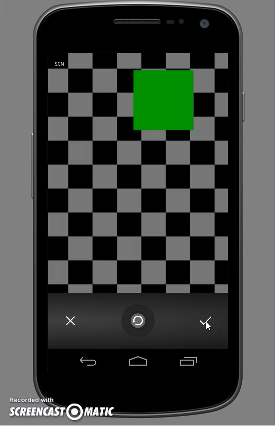
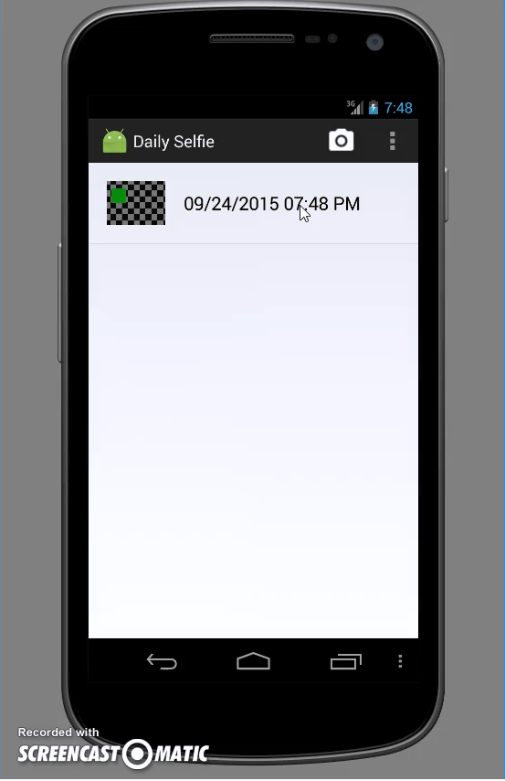
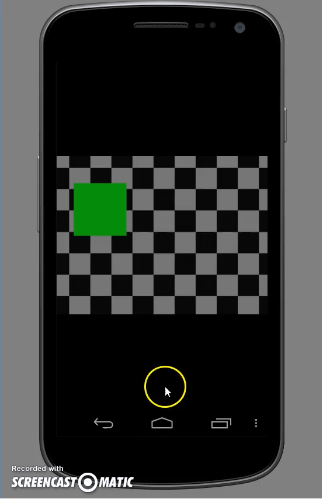
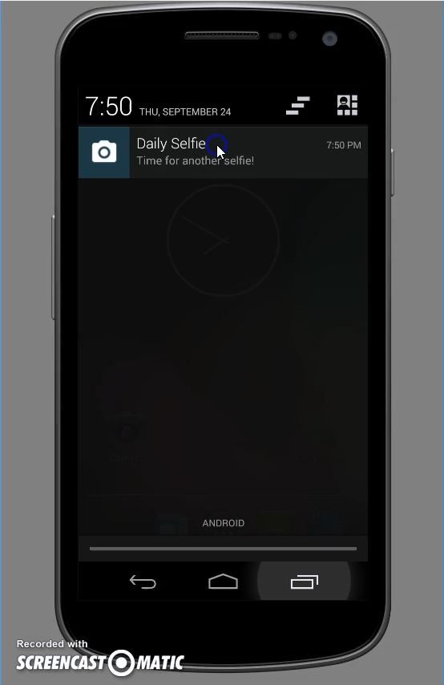

#DailySelfie

##A demonstration can be found [here](https://www.youtube.com/watch?v=HAvj_R8Tgdk).

**Requirements:**

- There should be an icon in the ActionBar.

- When it is clicked, the app will open up a picture taking application on the device.

- If the user takes a picture and accepts it, the picture is returned to the DailySelfie app and displayed to the user along with all previously taken selfies.

- If the user clicks on the small view, a large view of the photo will be shown.

- All pictures taken by the user must be stored permanently in some way. In particular, if the app is closed then reopened, the user should be able to access all the selfies saved on the device.

- The app should send a notification every two minutes reminding the user to take a new selfie.

----------

Course project for [Programming Mobile Applications for Android Handheld Systems: Part 2](https://www.coursera.org/course/androidpart2).
